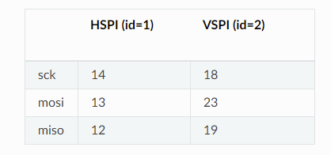
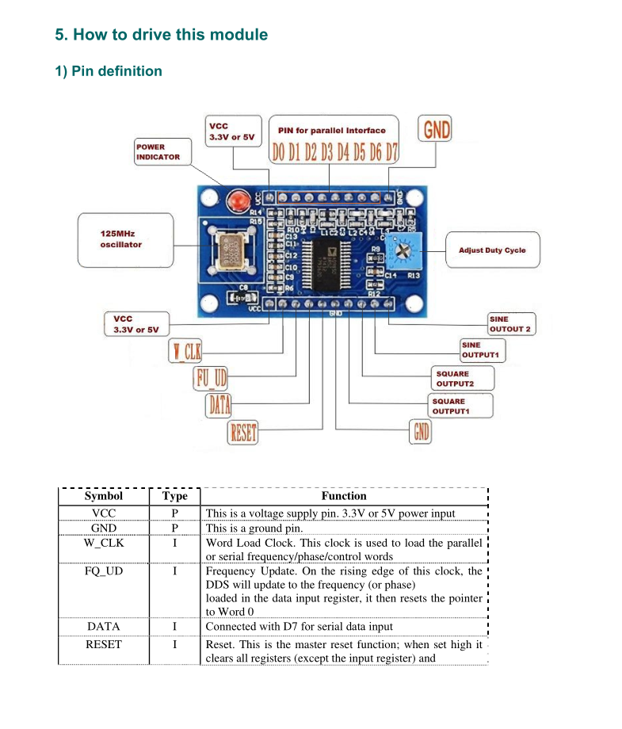
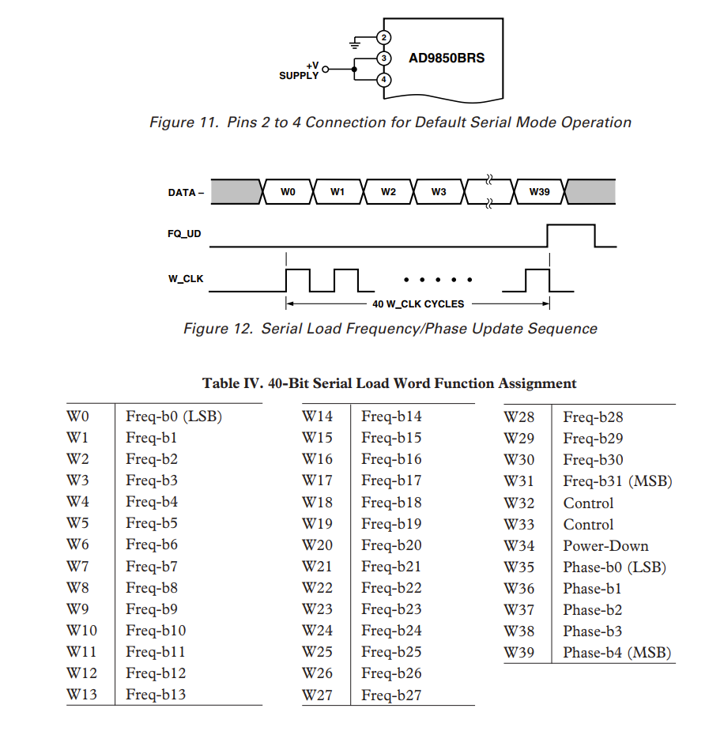

## Micropython ESP32/ESP8266 SPI library for the AD9850 synthesizer

### TL'DR
```python
# Import library
from ezeefix.ad9850 import SignalGen

# Default settings, works for both ESP8266 and ESP32
g = SignalGen()
g.set_frequency(40_000_000)

# esp32, spi 1 and alternative fqud/reset pin mapping
g = SignalGen(fqud_pin=18, reset_pin=19)
g.set_frequency(1_000_000)

# esp32, spi 2 and default fqud/reset pin mapping
g = SignalGen(spi_bus=2)
g.set_frequency(1_000)
```

### Default pin connections from ESP8266/ESP32 boards to AD9850
This library uses an SPI port and 2 additional pins (FQUD and RESET) to control the AD9850.
* GPIO04 -> FQUD
* GPIO05 -> RESET
* spi_bus = 1 (same pins on ESP2866 and ESP32)
* spi_bus = 2 (only available on ESP32)<p>


### AD9850 board from aliexpress


### AD9850 serial mode programming 
The board is set up to configure AD9850 in serial mode, allowing SPI programming  

